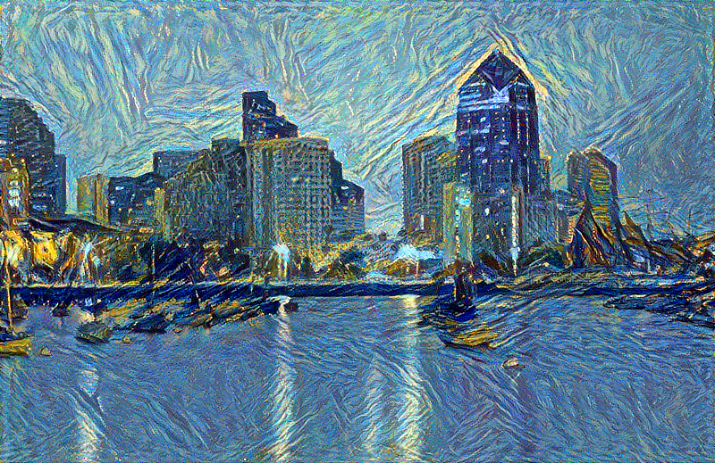
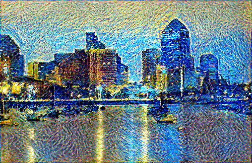

# "Neural Art" in TensorFlow

An implementation of ["A neural algorithm of Artistic style"](http://arxiv.org/abs/1508.06576) in TensorFlow, for

- Introductory, hackable demos for TensorFlow, and
- Demonstrating the use of importing various Caffe cnn models (VGG and illustration2vec) in TF.

In this work, I put effort in putting the code simple as possible, for being a good introductory code to TF. For this reason, I also implemented very basic uses of TensorBoard (the visualizer). I also aimed on demonstrating the use of importing various Caffe models from *.caffemodel files into TensorFlow, especially models that seemed not to be imported by anybody yet in TF (as far as I know). Based on [https://github.com/ethereon/caffe-tensorflow](https://github.com/ethereon/caffe-tensorflow), I modified the importer so that it can import illustration2vec (http://illustration2vec.net/), which is another CNN available as a Caffe model. Using different CNNs yields different results, which reflects the characteristics of the model.

In the Neural Art problem setting, the weights of the CNN are fixed, and the input image into the CNN is the only "trainable" variable, making the code easy to understand (the optimized/trained image is the output image). I hope this example serves as a good introduction to TensorFlow as well as for entertainment purposes.

(VGG, default settings, 70 iterations)

(illustration2vec, width=500, beta=10000, 100 iterations)

##Usage

### Step 0: Prepare the Caffe model
First, download either the VGG model or the illustration2vec model (\*.caffemodel), along with the prototxt (\*.prototxt):

- VGG: [https://gist.github.com/ksimonyan/211839e770f7b538e2d8#file-readme-md](https://gist.github.com/ksimonyan/211839e770f7b538e2d8#file-readme-md)
- illustration2vec: [http://illustration2vec.net/](http://illustration2vec.net/)   (pre-trained model for tag prediction, version 2.0)

Then, convert the model to a binary format recognizable to TensorFlow:

	python ./kaffe/kaffe.py [path.prototxt] [path.caffemodel] [output-path]

Note that Caffe is *not* required for conversion.

The converter included in this repo (all code inside ./kaffe) is a modified version of (an old version of) https://github.com/ethereon/caffe-tensorflow . The converter is modified to be capable of handling the illusration2vec neural network. Since the newer version of the converter requires preprocessing with the Caffe framework for old-format Caffe models (at the time of writing), I have included the converter which is based on the older code, which is capable of handling old-format Caffe models. 

### Step 1: Neural Art

	python neural-art-tf.py

Running `neural-art-tf.py` without options yields the default settings and input images. Available options are:

- `-m, --model`:      Model type - Use `vgg` or `i2v`
- `-mp, --modelpath`: Model file path - The path to the converted Caffe model in Step 0
- `-c, --content`:    Content image path
- `-s, --style`:      Style image path
- `-w, --width`:      Output image width
- `-i, --iters`:      Number of iterations
- `-a, --alpha`:      alpha (content weight)
- `-b, --beta`:       beta (style weight)

For example:

	python neural-art-tf.py -m vgg -mp ./vgg -c ./images/sd.jpg -s ./images/style.jpg -w 800

You can view the progress on tensorboard by running

	tensorboard --logdir=/tmp/na-logs

## References
- L. A. Gatys, et al., A neural algorithm of Artistic style, 2015, [http://arxiv.org/abs/1508.06576](http://arxiv.org/abs/1508.06576)
- [https://github.com/ethereon/caffe-tensorflow](https://github.com/ethereon/caffe-tensorflow) : The Caffe model converter
- [https://github.com/mattya/chainer-gogh](https://github.com/mattya/chainer-gogh) : Implementation in Chainer. Referenced the argument parser
- [https://github.com/anishathalye/neural-style](https://github.com/anishathalye/neural-style) : Another implementation in TensorFlow. Referenced the learning rates

- `./kaffe/caffepb.py` was referenced from [https://github.com/ethereon/caffe-tensorflow](https://github.com/ethereon/caffe-tensorflow).
- `./kaffe/kaffe.py`, `./network.py`, `./models.py` are modified versions originally from [https://github.com/ethereon/caffe-tensorflow](https://github.com/ethereon/caffe-tensorflow). (`./models.py` was originally `vgg.py`)
